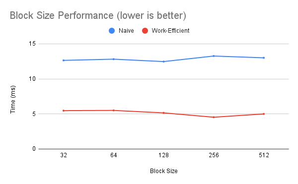
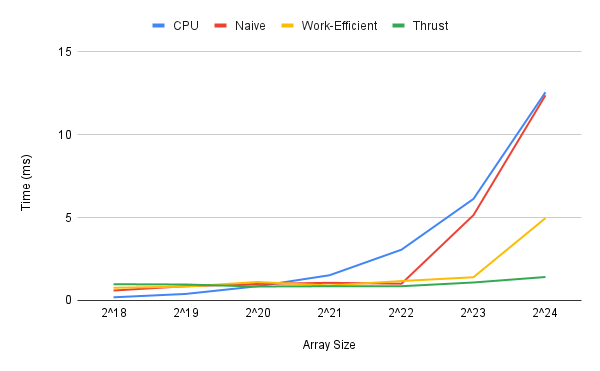
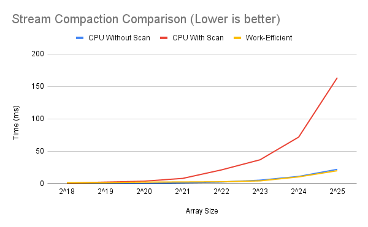

# CUDA Stream Compaction

**University of Pennsylvania, CIS 565: GPU Programming and Architecture, Project 2**

- Jacqueline Guan
  - [LinkedIn](https://www.linkedin.com/in/jackie-guan/)
  - [Personal website](https://jyguan18.github.io/)
- Tested on my personal laptop:
  - Windows 11 Pro 26100.4946
  - Processor AMD Ryzen 9 7945HX with Radeon Graphics
  - 32 GB RAM
  - Nvidia GeForce RTX 4080

# Introduction

In this project, I implemented a GPU stream compaction in CUDA, focusing on the core algorithms of parallel prefix sum (scan) and stream compaction. The primary goal was to remove zeros from an array of integers, which is a fundamental step for more complex GPU algorithms like accelerating a path tracer by removing terminated paths. The purpose of this project was to help think about data parallelism and the unique challenges and opportunities of programming for GPUs. This was done by implementing serial, naive parallel, work-efficient parallel, and Thrust-based livrary versions of the scan algorithm.

# Implementation Details

### Part 1: CPU Scan and Stream Compaction

I first implemented a CPU version of the scan and stream compaction algorithms in stream_compaction/cpu.cu. The CPU scan computes an exclusive prefix sum using a simple for loop. The stream compaction methods include:

- compactWithoutScan: A direct implementation that iterates through the array and copies non-zero elements
- compactWithScan: An implementation that first maps the input to an array of 0s and 1s, then uses a scan to determine the output positions, and finally uses a scatter operation to produce the compacted array.

### Part 2: Naive GPU Scan Algorithm

I implemented the naive GPU scan in stream_compaction/naive.cu. I used global memory and multiple kernel invocations to perform the scan. A challenge was managing race conditions using two separate device arrays and swapping them at each iteration to ensure correct reads and writes. The implementation also required careful handling of ilog2ceil(n) separate kernel launches.

### Part 3: Work Efficient GPU Scan and Stream Compaction

I implemented the work-efficient algorithm in stream_compaction/efficient.cu.

- Scan: The scan algorithm operates on a binary tree structure and is implemented in-place, which avoids the race conditions of the naive approach. I ensured the implementation correctly handles non-power-of-two sized arrays by padding.
- Stream Compaction: The stream compaction uses the scan function and a scatter algorithm. I implemented the helper kernels kernMapToBoolean and kernScatter in stream_compaction/common.cu.

### Part 4: Using Thrust's Implementation

For this part, I used the Thurst library to implement both scan and stream compaction in stream_compaction/thrust.cu. The scan implementation is a simple wrapper around thrust::exclusive_scan, which demonstrates how to leverage highly optimized, existing GPU libraries.

# Performance Analysis

This section presents the results of my performance analysis, comparing the different scan implementations. All measurements were taken with Release mode builds and without debugging.

### Block Size Optimization

Block size determines how many threads are grouped together and can significantly impact performance by affecting hardware occupancy. A block size that is too small may not launch enough threads to hide memory latency effectively. A block size that is too large may limit the number of blocks running on a single Streaming Multiprocessor (SM) due to resource constraints (like registers), which also hurts performannce.

Here, I tested the Naive and Work-Efficient scan implementations on a large array (2^24) using block sizes of 32, 64, 128, 256, and 512. The execution time for each was measured using an event timer, which excluded memory allocation and host-to-device transfers.



| Block Size | Naive Scan Time (ms) | Work-Efficient Scan Time (ms) |
| :--------- | :------------------: | :---------------------------: |
| 32         |        12.63         |             5.47              |
| 64         |        12.81         |             5.50              |
| 128        |      **12.46**       |             5.15              |
| 256        |        13.25         |           **4.53**            |
| 512        |        13.00         |             5.00              |

Based on these results, the optimal parameters are:

- Naive Scan: A block size of 128 was fastest at 12.46ms
- Work-Efficient Scan: A block size of 256 was fastest at 4.53ms

### Scan Performance

CPU Scan vs. GPU Scan:


This graph compares the run times of the serial CPU scan against the Naive, Work-Efficient, and Thrust GPU scan implementations across a range of array sizes.

In this graph, we can see that all of the algorithms have different performance characteristics as the input size grows.

- Thrust is the fastest implementation, especially as the array size increases. Since it is a NVIDIA library, we can see how much faster and the high level of optimization of it.
- The Work-Efficient scan is the second fastest GPU algorithm, but it is still slower than Thrust. Even so, there's a pretty clear performance advantage at arrays larger than 2^22. Since I did not implement shared memory, every intermediate calculation must pass through the slower global memory, which makes the algorithm more memory-bandwidth bound.
- The CPU and Naive GPU scans have really similar results. In fact, for array sizes lower than 2^22, it even sometimes looks faster than thrust or Work-Efficient scan.

### Performance Bottlenecks

- Naive GPU Scan: For the Naive GPU scan, I think the primary bottleneck is how each of the log n steps reads and writes the entire array from global memory and it does more operations than necessary.
- Work-Efficient GPU Scan: The up-sweep and down-sweep phases require multiple passes over the data. Since my implementation does not use on-chip shared memory, each of these passes must read from and write to the much slower global VRAM. This makes the algorithm memory-bound, as the GPU's powerful arithmetic units likely spend a significant amount of time waiting for data to arrive.
- CPU Scan: This can only perform one addition (or operation) at a time, making performance directly proportional to the array size. It can't take advantage of data parallelism so in large datasets, its performance quickly falls behind.

### Stream Compaction Peformance

To evaluate the effectiveness of the final GPU-accelerated stream compaction, I compared its performance with two CPU-based methods: compactWithScan and compactWithoutScan



| Array Size  | CPU Without Scan (ms) | CPU With Scan (ms) | GPU Work-Efficient (ms) |
| :---------- | :-------------------: | :----------------: | :---------------------: |
| 2^18 (262K) |       **0.17**        |        1.11        |          1.68           |
| 2^19 (524K) |       **0.36**        |        2.67        |          1.86           |
| 2^20 (1M)   |       **0.70**        |        4.04        |          2.68           |
| 2^21 (2M)   |       **1.72**        |        8.39        |          2.90           |
| 2^22 (4M)   |       **2.79**        |       21.44        |          3.22           |
| 2^23 (8M)   |         5.64          |       37.03        |        **4.55**         |
| 2^24 (16M)  |         11.41         |       72.01        |        **10.70**        |
| 2^25 (33M)  |         22.33         |       163.57       |        **20.20**        |

In this table and graph, there are a few things we can see.

- In smaller data sets, CPU does really well. For array sizes up to 4 million elements (2^22), it is clearly much faster. Its low overhead makes it ideal for moderately sized tasks
- The performance crossover point happens around 8 million elements (2^23). At this size, the parallelism of the Work-Efficient algorithm can start to be seen here, making it faster than the CPU method.
- At the largest tested size of 33 million elements, the GPU compaction is about 10% faster (20.2ms vs. 22.33ms) than the single-loop CPU version.
- The results confirm that GPU is memory-bound. The significant initial cost and slower-than-expected scaling are due to the multiple passes over global memory. It is when the dataset is so large that the CPU's own memory access becomes a bottleneck that GPU's raw computational throughout gives it the edge.

### Summary

This project successfully demonstrates the implementation and performance characteristics of several parallel scan and stream compaction algorithms. The analysis confirmed that while serial CPU code is effective for smaller datasets, well-designed GPU algorithms like the work-efficient scan offer a significant performance increase for larger, data-parallel workflows. In addition, the exceptional performance of the Thrust library highlights the power of using highly-tuned, hardware-aware libraries for common parallel primitives.

# Extra Credit

### Work-Efficient Scan Optimization

A common issue when implementing a work-efficient scan is that it can perform worse than a serial CPU implementation. This happens if the GPU is not used efficiently and there are a lot of threads that are not being used.

My impelmentation did not suffer from this issue because the number of thread blocks launched for each step was dynamically scaled according to the amount of work required at that level.
`dim3 blocksPerGrid((nPadded / 1 <<< (d + 1)) + blockSize - 1) / blockSize); `
As d increases, the number of blocks launched decreases, which keeps the active threads busy and avoids launching a large number of "lazy" threads.

# Application Output

```****************
** SCAN TESTS **
****************
    [   0   1   2   3   4   5   6   7   8   9  10  11  12 ... 16777214   0 ]
==== cpu scan, power-of-two ====
   elapsed time: 12.2615ms    (std::chrono Measured)
    [   0   0   1   3   6  10  15  21  28  36  45  55  66 ... -41943037 -25165823 ]
==== cpu scan, non-power-of-two ====
   elapsed time: 12.1849ms    (std::chrono Measured)
    [   0   0   1   3   6  10  15  21  28  36  45  55  66 ... -92274673 -75497462 ]
    passed
==== naive scan, power-of-two ====
   elapsed time: 12.7741ms    (CUDA Measured)
    [   0   0   1   3   6  10  15  21  28  36  45  55  66 ... -41943037 -25165823 ]
    passed
==== naive scan, non-power-of-two ====
   elapsed time: 11.8661ms    (CUDA Measured)
    passed
==== work-efficient scan, power-of-two ====
   elapsed time: 5.25357ms    (CUDA Measured)
    passed
==== work-efficient scan, non-power-of-two ====
   elapsed time: 4.76275ms    (CUDA Measured)
    passed
==== thrust scan, power-of-two ====
   elapsed time: 1.71027ms    (CUDA Measured)
    passed
==== thrust scan, non-power-of-two ====
   elapsed time: 1.31456ms    (CUDA Measured)
    passed

*****************************
** STREAM COMPACTION TESTS **
*****************************
    [   0   1   2   3   4   5   6   7   8   9  10  11  12 ... 16777214   0 ]
==== cpu compact without scan, power-of-two ====
   elapsed time: 11.6285ms    (std::chrono Measured)
    [   1   2   3   4   5   6   7   8   9  10  11  12  13 ... 16777213 16777214 ]
    passed
==== cpu compact without scan, non-power-of-two ====
   elapsed time: 11.2948ms    (std::chrono Measured)
    [   1   2   3   4   5   6   7   8   9  10  11  12  13 ... 16777211 16777212 ]
    passed
==== cpu compact with scan ====
   elapsed time: 58.9926ms    (std::chrono Measured)
    [   1   2   3   4   5   6   7   8   9  10  11  12  13 ... 16777213 16777214 ]
    passed
==== work-efficient compact, power-of-two ====
   elapsed time: 12.5078ms    (CUDA Measured)
    [   1   2   3   4   5   6   7   8   9  10  11  12  13 ... 16777213 16777214 ]
    passed
==== work-efficient compact, non-power-of-two ====
   elapsed time: 10.498ms    (CUDA Measured)
    [   1   2   3   4   5   6   7   8   9  10  11  12  13 ... 16777211 16777212 ]
    passed
```
